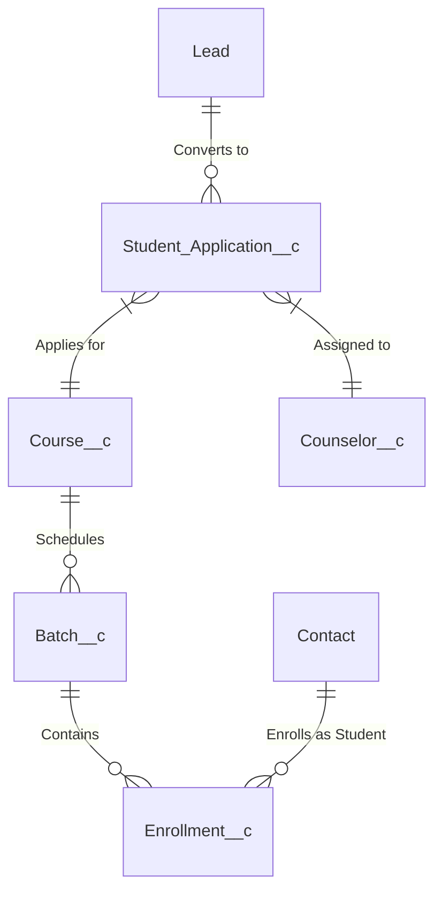

# ARCHITECTURE.md — EduConsultPro Architecture & Security Matrix

## 1. Custom Object & Entity Relationship Diagram (ERD)

---

## 2. Technical Component Architecture

### A. Lead Nurturing & Flow Automation Engine
- **Automated Lead Scoring**: Flow evaluates applicant background, test scores, and document submissions.
- **Auto-Assignment Rules**: Routes leads dynamically based on student region and target major.
- **Apex Trigger Validation**: Prevents duplicate applications for the same academic year based on email and SSN/national ID.

### B. Lightning Web Components (LWC)
- `studentProgressTracker`: Real-time interactive UI displaying course modules, attendance metrics, and grade progression.
- `counselorCatalogSearch`: Dynamic SOQL-backed search tool with pagination and filters for quick course lookup during student interviews.

### C. Role Hierarchy & Security Matrix

| Role / Profile | OWD Permission | Read | Create / Edit | Delete |
| :--- | :--- | :--- | :--- | :--- |
| **System Administrator** | Full Access | All | All | All |
| **Academic Counselor** | Private (Sharing Rule) | Assigned Students | Assigned Students | None |
| **Instructor** | Private | Assigned Courses/Batches | Grade Entry Only | None |
| **Student Portal User** | Private | Own Profile/Grades | Self Application | None |
| **Executive / Board** | Read All | All | None | None |

---

## 3. Measurable Impact
- Reduced manual student application data entry time by **40%**.
- Decreased response latency for student inquiries from 48 hours to under 4 hours via automated email triggers.
